# 📦 InvenTrack — Inventory Management System

> A full-stack web application for managing inventory, stock levels, and item requests with role-based access control.

---

## 🌐 Live Links

| Service | URL |
|---|---|
| 🖥️ Frontend (Angular) | https://inventorytracksystem.netlify.app|
| ⚙️ Backend API (Node.js) | https://inventory-management-system-a1um.onrender.com |


## 🛠️ Tech Stack

### Frontend
| Tech | Purpose |
|---|---|
| Angular 17+ | Component-based SPA framework |
| Tailwind CSS v3 | Responsive UI styling |
| TypeScript | Typed JavaScript |
| RxJS | Reactive programming / Observables |
| Angular Router | Client-side routing + Route Guards |
| Angular HTTP Client | API integration |
| Reactive Forms | Form handling and validation |

### Backend
| Tech | Purpose |
|---|---|
| Node.js | JavaScript runtime |
| Express.js | REST API framework |
| TypeScript | Typed server-side code |
| MySQL2 | Database driver |
| JSON Web Token (JWT) | Authentication |
| Bcryptjs | Password hashing |
| Multer | File upload handling |
| Morgan | HTTP request logging |
| CORS | Cross-origin resource sharing |
| Swagger UI Express | API documentation |

### Database
| Tech | Purpose |
|---|---|
| MySQL | Relational database |


## SETUP INTRUCTIONS

 Frontend Setup

```bash
cd client
npm install
ng serve
```

 Backend Setup

```bash
cd server
npm install
```
Run the backend:

```bash
npm run dev
```

## � Troubleshooting

### If It Shows an Error — Fix Swagger Setup

Check your `server/src/index.ts` — make sure swagger is set up like this:

```typescript
import express from 'express';
import cors from 'cors';
import morgan from 'morgan';
import swaggerUi from 'swagger-ui-express';
import YAML from 'yamljs';
import path from 'path';

const app = express();

// Swagger
const swaggerDocument = YAML.load(path.join(__dirname, '../swagger.yaml'));
app.use('/api-docs', swaggerUi.serve, swaggerUi.setup(swaggerDocument));
```

### If swagger.yaml is Empty — Add Basic Content

Open `server/swagger.yaml` and ensure it contains the complete OpenAPI specification with all endpoints properly documented. The file should include:
- API metadata (title, version, servers)
- Security schemes (Bearer Token / JWT)
- All endpoint definitions organized by tags (Auth, Products, Categories, Requests, Users)
- Request/response schemas for each endpoint

If the file is empty, run the backend setup again and verify the Swagger documentation loads at: `http://localhost:3000/api-docs`

---

## �📡 API Overview

### Auth
| Method | Endpoint | Description | Access |
|---|---|---|---|
| POST | `/api/auth/register` | Register new user | Public |
| POST | `/api/auth/login` | Login and get JWT token | Public |

### Users
| Method | Endpoint | Description | Access |
|---|---|---|---|
| GET | `/api/users/profile` | Get current user profile | User |
| PUT | `/api/users/profile` | Update profile + photo | User |
| GET | `/api/users` | Get all users | Admin |
| GET | `/api/users/dashboard` | Get dashboard stats | Admin |

### Categories
| Method | Endpoint | Description | Access |
|---|---|---|---|
| GET | `/api/categories` | Get all categories | Public |
| POST | `/api/categories` | Create category | Admin |
| PUT | `/api/categories/:id` | Update category | Admin |
| DELETE | `/api/categories/:id` | Delete category | Admin |

### Products
| Method | Endpoint | Description | Access |
|---|---|---|---|
| GET | `/api/products` | Get all products (search, filter, paginate) | User |
| GET | `/api/products/:id` | Get product by ID | User |
| POST | `/api/products` | Create product + image upload | Admin |
| PUT | `/api/products/:id` | Update product + image | Admin |
| DELETE | `/api/products/:id` | Delete product | Admin |
| PATCH | `/api/products/:id/stock` | Update stock level | Admin |

### Requests
| Method | Endpoint | Description | Access |
|---|---|---|---|
| POST | `/api/requests` | Submit inventory request | User |
| GET | `/api/requests/my` | Get my requests | User |
| GET | `/api/requests` | Get all requests | Admin |
| PATCH | `/api/requests/:id/status` | Approve / reject / fulfill | Admin |
| DELETE | `/api/requests/:id` | Delete request | User/Admin |

---

## ✅ Features Implemented

### Frontend (Angular)
- [x] Component-based architecture with standalone components
- [x] Angular Routing with `authGuard` and `adminGuard`
- [x] Reactive Forms with full validation
- [x] HTTP Client with Auth Interceptor (JWT injection)
- [x] RxJS Observables, `BehaviorSubject`, `tap`, `catchError`
- [x] Tailwind CSS — fully responsive (mobile, tablet, desktop)
- [x] Loading states and error handling on all pages
- [x] Service-based state management (`AuthService`)
- [x] Role-based UI (admin sidebar vs user navbar)

### Backend (Node.js + Express)
- [x] RESTful API with full CRUD operations
- [x] Proper MVC structure — routes, controllers, middleware
- [x] CORS, Morgan logging, global error handler middleware
- [x] Input validation and sanitization in all controllers
- [x] JWT Authentication with 24h expiry
- [x] Role-based Authorization (`requireAdmin` middleware)
- [x] MySQL database with relational schema
- [x] File upload with Multer (product images + profile photos)
- [x] Swagger API documentation at `/api-docs`
- [x] Auto stock status update (available / low_stock / out_of_stock)

### System Features
- [x] User Registration and Login
- [x] Role-based Access Control (Admin / User)
- [x] Product CRUD with image upload
- [x] Category CRUD
- [x] Inventory Request System (submit, approve, reject, fulfill)
- [x] Search, filtering, and pagination on all list pages
- [x] Admin Dashboard with live stats and alerts
- [x] Low stock and out-of-stock alerts
- [x] Profile management with photo upload
- [x] Responsive design on all screen sizes


## 📸 Screenshots

### UI Screenshots
| Page | Preview |
|---|---|
| Home Page | 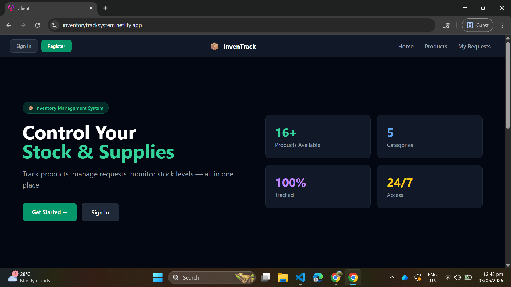 |
| Login Page | 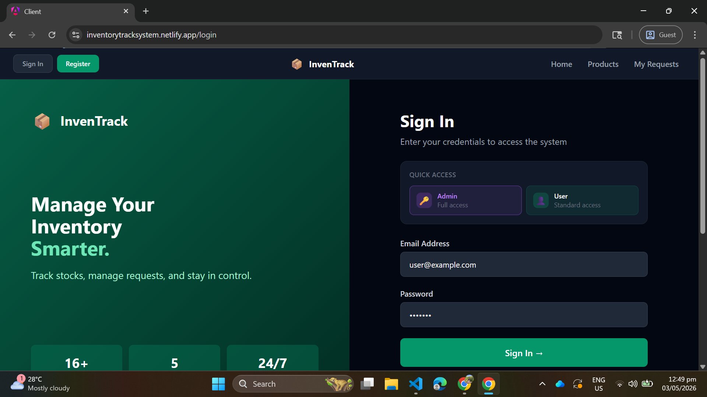 |
| Register Page | 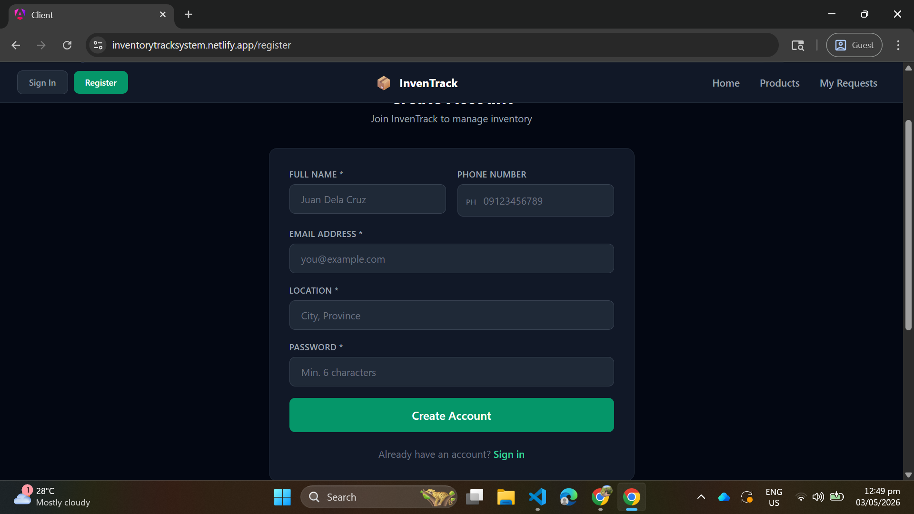 |
| Products Page |  |
| Product Detail | 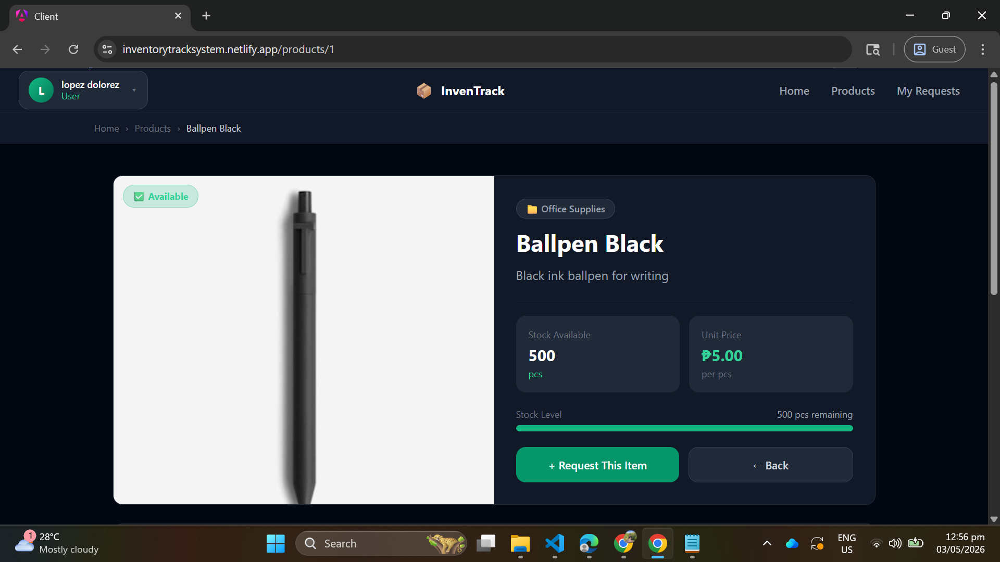 |
| My Requests |  |
| Profile | 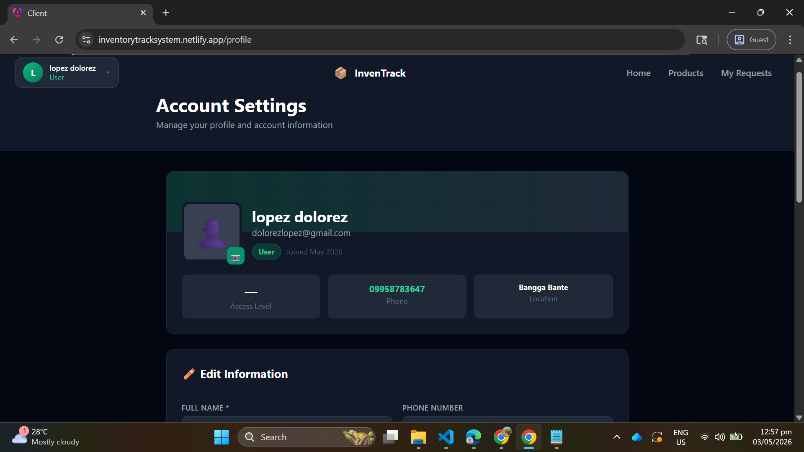 |
| Admin Dashboard | 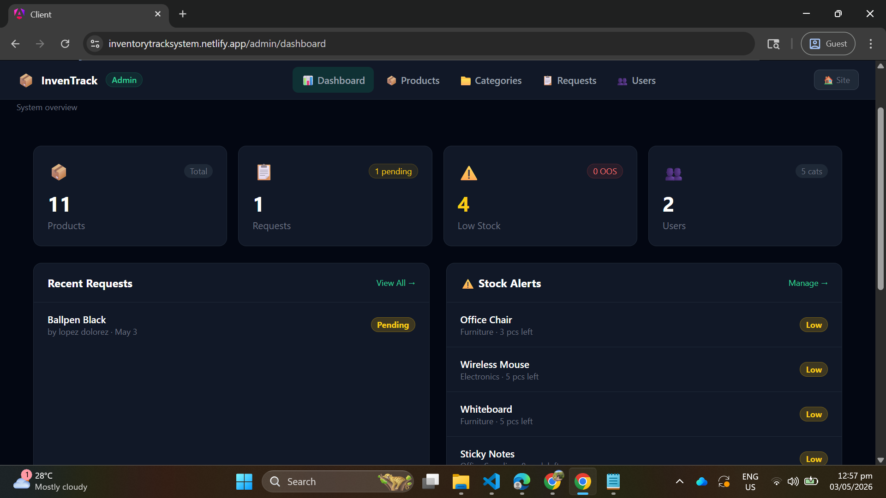 |
| Manage Products | 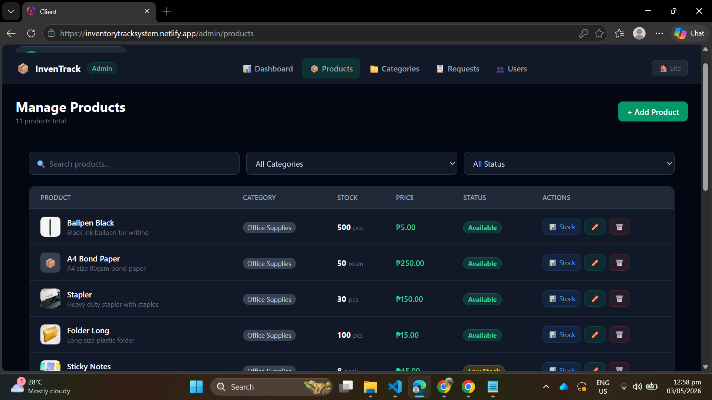 |
| Manage Categories | 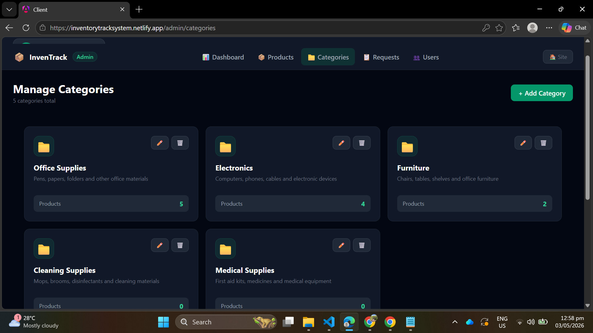 |
| Manage Requests | 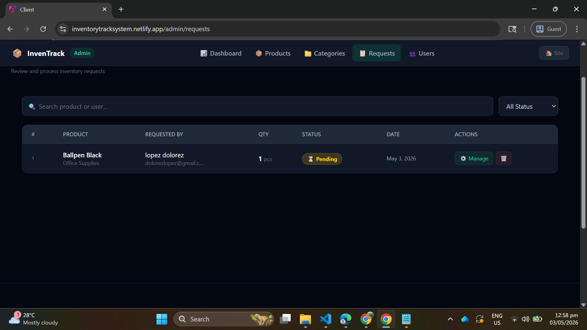 |
| Manage Users | 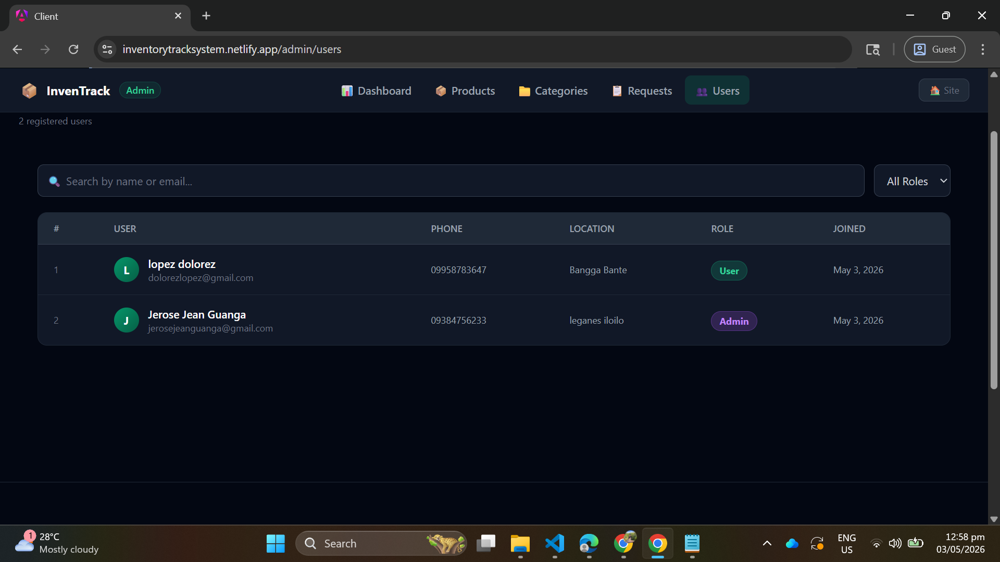 |

### API Testing (Postman)
| Endpoint | Preview |
|---|---|
| POST /api/auth/login | 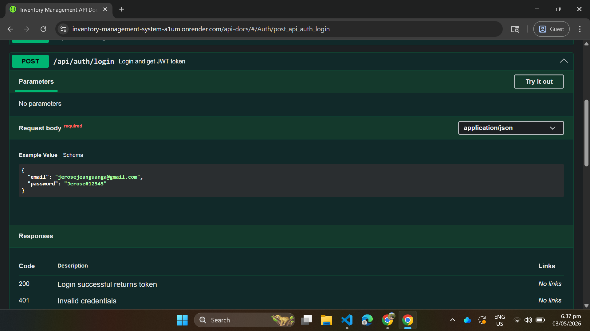 |
| GET /api/products | 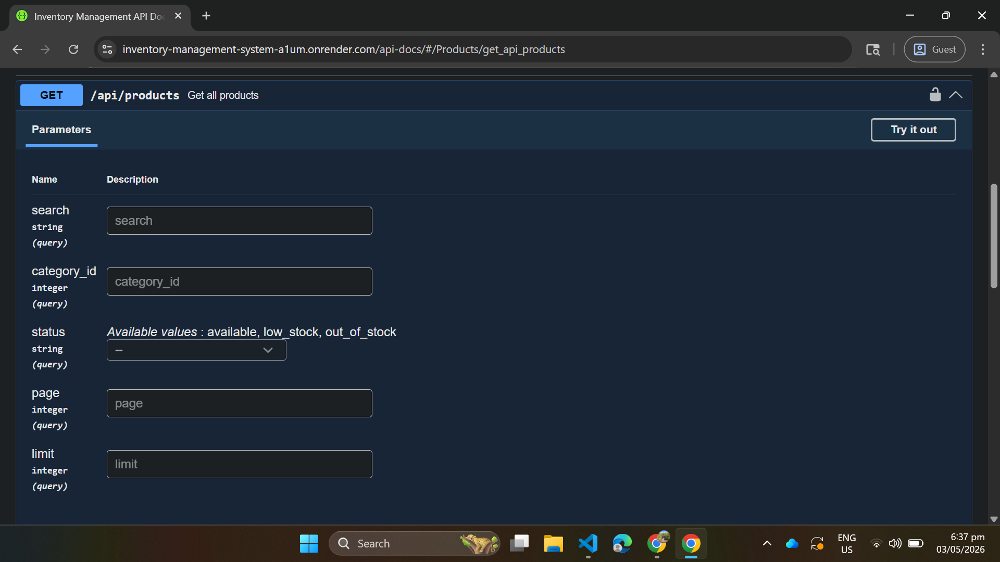 |
| POST /api/requests | 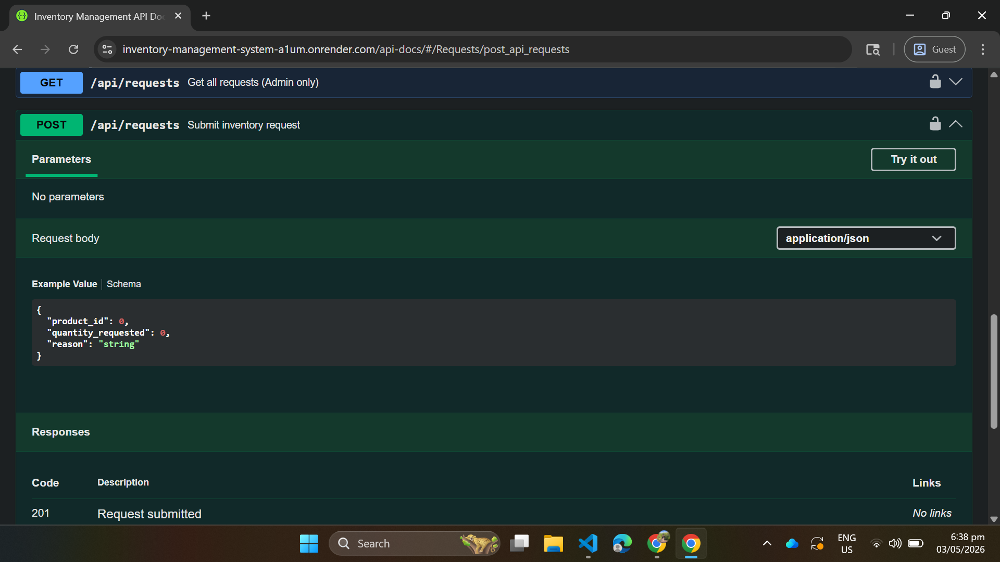 |
| PATCH /api/requests/:id/status | 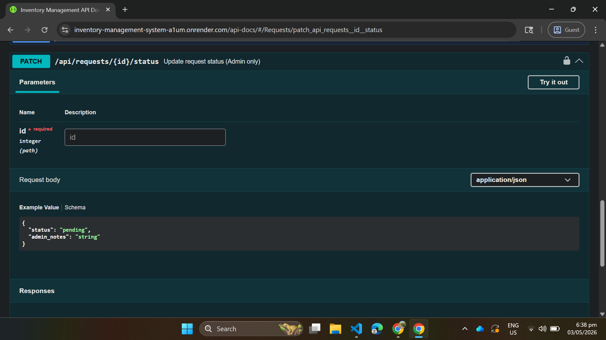 |
